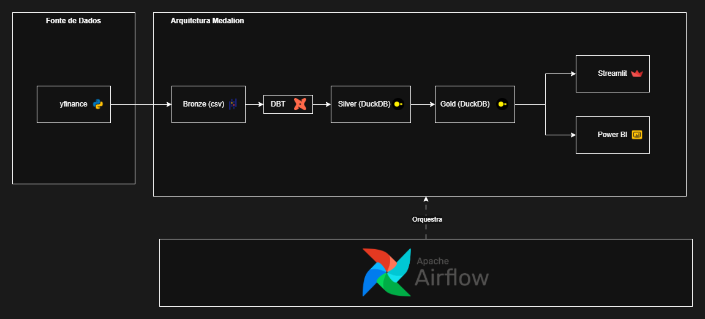

# Pipeline de Cotacoes B3

pipeline de dados para coleta, tratamento e analise de cotacoes da b3, seguindo a arquitetura medalion

---


# Arquitetura

- **Bronze** — dados brutos extraídos via yfinance em CSV
- **Silver** — dados limpos e tipados via dbt (stage_cotacoes)
- **Gold** — modelos analíticos via dbt (retorno diário e volatilidade)
- Orquestrado pelo **Apache Airflow** rodando em Docker.
## Estrutura
pipeline-financas-b3/  
├── source/          ← scripts de extração  
├── cotacoes_b3/     ← projeto dbt  
│   ├── models/  
│   │   ├── staging/ ← camada silver  
│   │   └── marts/   ← camada gold  
├── data/  
│   └── bronze/      ← dados brutos CSV  
└── docs/            ← diagramas e documentação  

## 🗒️Stack
- **yfinance** — coleta de cotações da B3
- **pandas** — manipulação dos dados
- **dbt + DuckDB** — transformação em camadas bronze/silver/gold
- **Apache Airflow** — orquestração e agendamento do pipeline
- **Streamlit** — visualização dos dados

## Como rodar

### Pré-requisitos
- Docker Desktop instalado e rodando
- Git instalado

### 1. Clonar o repositório
```bash
git clone https://github.com/Huguilhas/pipeline-financas-b3.git
cd pipeline-financas-b3
```

### 2. Subir o ambiente
```bash
docker compose up --build -d
```

### 3. Acessar o Airflow
- URL: http://localhost:8080
- Usuário: `admin`
- Senha: `admin`

### 4. Executar o pipeline
- Acesse a DAG `pipeline_cotacoes_b3`
- Clique em **Trigger DAG**

---

### Rodar localmente sem Docker

### 1. Criar ambiente virtual
```bash
python -m venv venv
venv\Scripts\activate
pip install -r requirements.txt
```

### 2. Extrair dados
```bash
python source/extracao.py
```

### 3. Rodar transformações dbt
```bash
cd cotacoes_b3
dbt run
dbt test
```